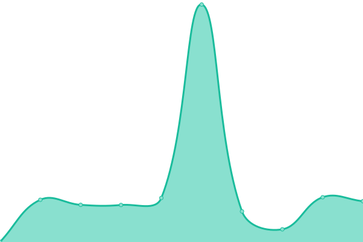
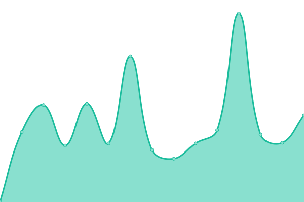
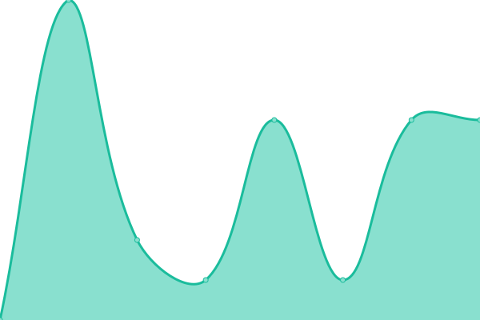
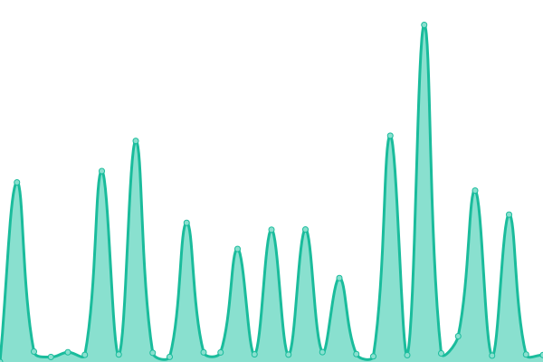

This repository contains the open-source uptime monitor and status page for [Richard Hu](hzk.is-a-good.dev), powered by [Upptime](https://github.com/upptime/upptime).

> [!NOTE]
>
> ### [📈 网站状态](https://PowerfulRichard.github.io/PT-Status): <!--live status--> **所有网站正常运行**

<!--start: status pages-->
<!-- This summary is generated by Upptime (https://github.com/upptime/upptime) -->
<!-- Do not edit this manually, your changes will be overwritten -->
<!-- prettier-ignore -->
| 链接 | 状态 | 历史 | 响应时间 | 正常运行时间 |
| --- | ------ | ------- | ------------- | ------ |
|  CHDBits | 🟩 正常运行 | [chd-bits.yml](https://github.com/PowerfulRichard/PT-Status/commits/HEAD/history/chd-bits.yml) | 

 74毫秒
     
 | 

<a href="https://PowerfulRichard.github.io/PT-Status/history/chd-bits">100.00%</a>
    

|  Femdomcult | 🟩 正常运行 | [femdomcult.yml](https://github.com/PowerfulRichard/PT-Status/commits/HEAD/history/femdomcult.yml) | 

 104毫秒
     
 | 

<a href="https://PowerfulRichard.github.io/PT-Status/history/femdomcult">100.00%</a>
    

|  GreatPostWall(GPW) | 🟩 正常运行 | [great-post-wall-gpw.yml](https://github.com/PowerfulRichard/PT-Status/commits/HEAD/history/great-post-wall-gpw.yml) | 

 550毫秒
     
 | 

<a href="https://PowerfulRichard.github.io/PT-Status/history/great-post-wall-gpw">100.00%</a>
    

|  GT-Org | 🟩 正常运行 | [gt-org.yml](https://github.com/PowerfulRichard/PT-Status/commits/HEAD/history/gt-org.yml) | 

 668毫秒
     
 | 

<a href="https://PowerfulRichard.github.io/PT-Status/history/gt-org">96.89%</a>
    

|  GTru | 🟩 正常运行 | [g-tru.yml](https://github.com/PowerfulRichard/PT-Status/commits/HEAD/history/g-tru.yml) | 

 1258毫秒
     
 | 

<a href="https://PowerfulRichard.github.io/PT-Status/history/g-tru">99.42%</a>
    

|  HDArea | 🟩 正常运行 | [hd-area.yml](https://github.com/PowerfulRichard/PT-Status/commits/HEAD/history/hd-area.yml) | 

 515毫秒
     
 | 

<a href="https://PowerfulRichard.github.io/PT-Status/history/hd-area">100.00%</a>
    

|  HDAtoms | 🟩 正常运行 | [hd-atoms.yml](https://github.com/PowerfulRichard/PT-Status/commits/HEAD/history/hd-atoms.yml) | 

 1238毫秒
     
 | 

<a href="https://PowerfulRichard.github.io/PT-Status/history/hd-atoms">99.80%</a>
    

|  HDFans | 🟩 正常运行 | [hd-fans.yml](https://github.com/PowerfulRichard/PT-Status/commits/HEAD/history/hd-fans.yml) | 

 530毫秒
     
 | 

<a href="https://PowerfulRichard.github.io/PT-Status/history/hd-fans">100.00%</a>
    

|  HDZone | 🟩 正常运行 | [hd-zone.yml](https://github.com/PowerfulRichard/PT-Status/commits/HEAD/history/hd-zone.yml) | 

 128毫秒
     
 | 

<a href="https://PowerfulRichard.github.io/PT-Status/history/hd-zone">100.00%</a>
    

|  KamePT | 🟩 正常运行 | [kame-pt.yml](https://github.com/PowerfulRichard/PT-Status/commits/HEAD/history/kame-pt.yml) | 

 5毫秒
     
 | 

<a href="https://PowerfulRichard.github.io/PT-Status/history/kame-pt">100.00%</a>
    

|  M-Team | 🟩 正常运行 | [m-team.yml](https://github.com/PowerfulRichard/PT-Status/commits/HEAD/history/m-team.yml) | 

 353毫秒
     
 | 

<a href="https://PowerfulRichard.github.io/PT-Status/history/m-team">100.00%</a>
    

|  PT-Time | 🟩 正常运行 | [pt-time.yml](https://github.com/PowerfulRichard/PT-Status/commits/HEAD/history/pt-time.yml) | 

 5毫秒
     
 | 

<a href="https://PowerfulRichard.github.io/PT-Status/history/pt-time">100.00%</a>
    

|  TorrentLeech | 🟩 正常运行 | [torrent-leech.yml](https://github.com/PowerfulRichard/PT-Status/commits/HEAD/history/torrent-leech.yml) | 

 2688毫秒
     
 | 

<a href="https://PowerfulRichard.github.io/PT-Status/history/torrent-leech">98.83%</a>
    

<!--end: status pages-->

[**Visit our status website →**](https://PowerfulRichard.github.io/PT-Status)
